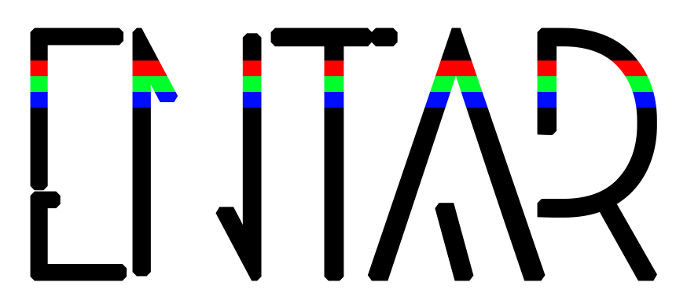

# ENTAR v.1.0
Ensemble of Neural Tools for Animations Restoration

**Check how it works on Google Colab:**
- [Russian Language](https://colab.research.google.com/github/tg-bomze/ENTAR/blob/master/ENTAR_Rus.ipynb)
- [Bad English Translation](https://colab.research.google.com/github/tg-bomze/ENTAR/blob/master/ENTAR_Eng.ipynb)

**This ensemble includes:**
1. [DeOldify](https://github.com/jantic/DeOldify)
2. [DeepRemaster](https://github.com/satoshiiizuka/siggraphasia2019_remastering)
3. [VFIASC](https://github.com/sniklaus/sepconv-slomo)

**In addition, there are:**
- [Fast-SRGAN](https://github.com/HasnainRaz/Fast-SRGAN)
- [VFI-CFT](https://github.com/MortenHannemose/pytorch-vfi-cft)
- [3D Ken Burns](https://github.com/sniklaus/3d-ken-burns)

**Result Example:**

